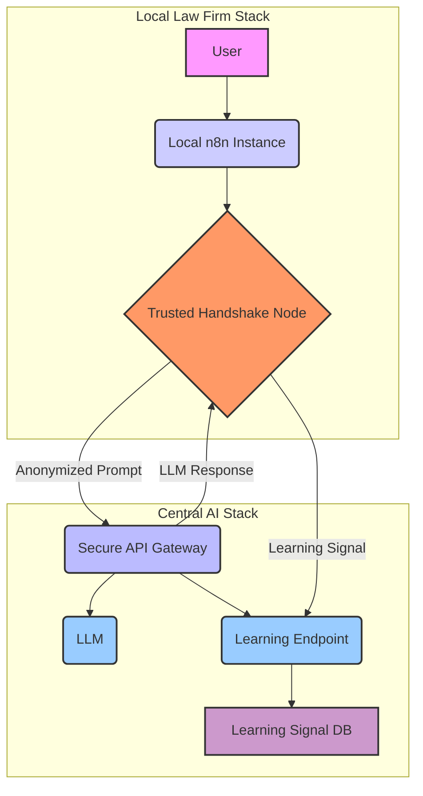
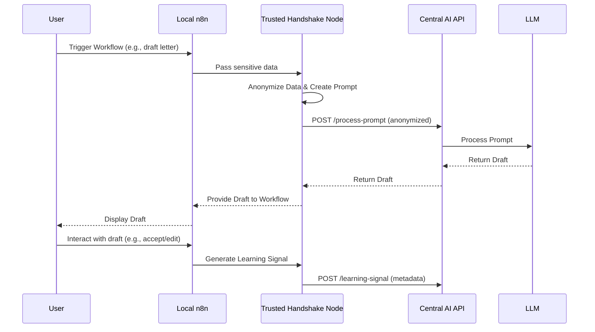

# Law Firm 2030: Federated AI Infrastructure - Execution Plan

## 1. Project Vision: The "Trusted Handshake" Model

This document outlines the execution plan for building the foundational infrastructure for the "Law Firm 2030" platform. The core of this plan is the **"Trusted Handshake"** model, a federated AI architecture designed to be scalable, secure, and GDPR-compliant.

The primary goal is to enable law firms to run their own local n8n instances for process automation while leveraging a powerful, centrally-hosted LLM. This is achieved by ensuring sensitive data never leaves the local environment. Instead, anonymized, structured prompts are sent to the central AI, and abstract "learning signals" are returned to continuously fine-tune the model.

## 2. Prerequisites & Client Input

To ensure a successful and timely start to the project, the following inputs are required from the client:

*   **API Credentials**: Access to the chosen LLM provider (e.g., Together.ai API key).
*   **Example Documents**: A small, representative sample of the legal documents to be processed (e.g., 2-3 debt collection letters). This is crucial for developing the anonymization logic.
*   **Task Definitions**: A clear definition of the initial legal tasks to be automated (e.g., "First Reminder for Unpaid Invoice," "Client Intake Summary").

## 3. Core Architecture

The system is composed of four distinct components, as illustrated in the diagram below.



## 4. Data Flow & Process Maps

The following sequence diagram illustrates the end-to-end "Trusted Handshake" process.



## 5. Development Methodology

This project will follow an **agile, iterative approach**. The 2-3 week timeline is structured as a single sprint with a clear goal: to deliver a functional Proof-of-Concept (PoC).

*   **Daily Stand-ups**: Brief, daily updates to ensure alignment and address any blockers.
*   **Weekly Demos**: A weekly demonstration of progress to the client to ensure the project is on track and to gather feedback early and often.
*   **Continuous Integration**: As the project matures, we will implement CI/CD pipelines to automate testing and deployment.

## 6. Technology Stack: Deeper Dive

| Component                   | Technology                               | Rationale                                                                                                                                                           |
| --------------------------- | ---------------------------------------- | ------------------------------------------------------------------------------------------------------------------------------------------------------------------- |
| **Local Stack**             | Docker Compose, n8n, Postgres, TypeScript | **Docker Compose** provides a simple, declarative way to define and run the multi-container local environment. **n8n** is the core of the local automation. **Postgres** is a robust, open-source database for local data storage. **TypeScript** is used for the custom n8n node, providing type safety and better maintainability. |
| **Central AI Stack**        | Python (FastAPI), Together.ai, Postgres  | **FastAPI** is a modern, high-performance Python web framework that is perfect for building APIs. Its automatic data validation and documentation features will be invaluable. **Together.ai** provides a simple, pay-per-use API for accessing powerful LLMs without the overhead of self-hosting. **Postgres** will be used to store the learning signals. |
| **Communication**           | RESTful API, JWT                         | A **RESTful API** is the industry standard for web-based communication. **JWT (JSON Web Tokens)** will be used for stateless, secure authentication of each law firm's API requests. |
| **Deployment**              | Git, Docker Hub                          | **Git** will be used for version control. **Docker Hub** will be used to host the Docker image for the local stack, making it easy for new firms to pull and deploy. |

## 7. Proof-of-Concept Milestones (As User Stories)

*   **Milestone 1: The Central Brain**
    *   **As the platform owner, I want a secure central API** so that local n8n instances can request document processing and submit learning signals, forming the core of our AI infrastructure.

*   **Milestone 2: The Local Guardian**
    *   **As a law firm user, I want a secure n8n node** that automatically anonymizes my data so that I can leverage the central AI without compromising client confidentiality.

*   **Milestone 3: The First Handshake**
    *   **As a developer, I want to see a successful end-to-end test** where a local workflow sends a prompt and receives a response, proving the entire architecture is viable.

*   **Milestone 4: The Onboarding Kit**
    *   **As a new law firm, I want a simple, well-documented way to deploy the local stack** so that I can quickly and easily join the "Law Firm 2030" network.

## 8. Data Contracts

*   **Anonymized Prompt (Local to Central):**
    ```json
    {
      "task_type": "debt_collection_letter",
      "style_guide": "formal",
      "anonymized_context": {
        "debt_amount": 1500,
        "days_overdue": 30,
        "product_category": "electronics"
      }
    }
    ```

*   **Learning Signal (Local to Central):**
    ```json
    {
      "request_id": "uuid-1234",
      "firm_id": "firm-abc",
      "task_type": "debt_collection_letter",
      "outcome": "accepted_no_edits",
      "user_feedback_score": 1.0,
      "timestamp": "2025-07-15T10:00:00Z"
    }
    ```

## 9. Security & Compliance: A Deeper Look

*   **Authentication**: Each law firm will be issued a unique, revocable JWT. This token must be included in the `Authorization` header of every API request. The central API will validate the token's signature and expiration date on every call.
*   **Transport Security**: All communication between the local n8n instance and the central API will be encrypted using TLS 1.2 or higher (HTTPS).
*   **Data Privacy (GDPR) by Design**:
    *   **PII Stripping**: The "Trusted Handshake" node will use a combination of regular expressions and named entity recognition (NER) to identify and remove PII (names, addresses, phone numbers, etc.) from the data before it is sent to the central API.
    *   **Schema Validation**: The central API will enforce a strict JSON schema for all incoming requests. Any request that contains fields that are not in the predefined schema will be rejected. This prevents accidental leakage of sensitive data.
    *   **No Sensitive Data Storage**: The central database will only store the anonymized learning signals. No PII or other sensitive data will ever be stored on the central servers.

## 10. High-Level Timeline

*   **Week 1**: Milestones 1 & 2
*   **Week 2**: Milestone 3
*   **Week 3**: Milestone 4