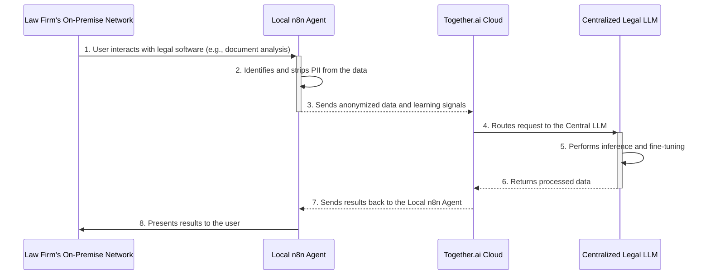

# Technical Execution Plan: Central LLM Hosting

**Author:** GEORGE, Project Developer
**Status:** For Review
**Version:** 1.0

## 1. Introduction

This document provides a detailed technical comparison between hosting our central LLM on **Together.ai** versus a **self-hosted, on-premise** infrastructure. The goal is to evaluate the options against the specific technical and operational requirements of the "Law Firm 2030" project. This plan will inform the final decision on our hosting strategy for the central AI component.

The core of our architecture, the "Trusted Handshake" model, is designed to be hosting-agnostic for the central LLM. It ensures PII remains on-premise at each law firm, mitigating the most significant data privacy risks. Therefore, this evaluation focuses on scalability, cost, ownership, and the operational implications of compliance.

## 2. Detailed Comparison Criteria

### 2.1. Scalability

**Technical Challenge:** The central LLM must serve a growing, geographically distributed network of law firms with unpredictable, fluctuating workloads.

*   **Together.ai (Cloud-based):**
    *   **Mechanism:** Provides serverless or dedicated endpoints built on a global, multi-cloud GPU infrastructure. Scaling is managed automatically by the platform.
    *   **Performance:** Offers a 99.9% uptime SLA. Can scale from a few GPUs to over 1000, ensuring the system can handle both initial low-volume usage and future high-demand scenarios without manual intervention.
    *   **Implementation:** We would interact with a stable API endpoint. The complexity of load balancing, instance provisioning, and hardware maintenance is entirely abstracted away.

*   **Local LLM Hosting (On-premise):**
    *   **Mechanism:** Requires manual procurement, installation, and configuration of GPU servers, networking hardware, and cooling infrastructure.
    *   **Performance:** Scaling is a significant engineering effort. To handle peak loads, we would need to over-provision hardware, leading to idle resources and increased cost. Dynamic scaling would require a sophisticated internal orchestration layer (e.g., Kubernetes with GPU support), adding significant complexity.
    *   **Implementation:** A dedicated in-house team would be responsible for infrastructure management, monitoring, and capacity planning. This diverts resources from our core mission of developing the legal AI.

### 2.2. Cost Analysis

**Technical Challenge:** The project needs a cost model that supports agile development and encourages adoption by law firms of varying sizes.

*   **Together.ai (Cloud-based):**
    *   **Model:** Consumption-based (e.g., per hour for GPU clusters). This translates to a variable operational expenditure (OpEx) model.
    *   **Financials:** No upfront capital expenditure (CapEx). Costs are predictable and directly tied to usage. Their pricing is highly competitive (e.g., stated 11x lower than GPT-4o), which is beneficial for fine-tuning and running multiple model variants.
    *   **Risk:** Lower financial risk. We can start small and scale costs as revenue and usage grow.

*   **Local LLM Hosting (On-premise):**
    *   **Model:** High CapEx for hardware, plus ongoing OpEx for power, cooling, and IT staff.
    *   **Financials:** Requires a significant upfront investment, which could be a barrier to getting the project off the ground. While the long-term cost per inference *might* be lower at extremely high, constant utilization, this is not our expected usage pattern, especially in the early years.
    *   **Risk:** High financial risk. The initial investment is sunk, regardless of project adoption or success.

### 2.3. Ownership & IP Rights

**Technical Challenge:** The project's primary value is the proprietary, fine-tuned legal AI. We must retain full, unencumbered ownership of this IP.

*   **Together.ai (Cloud-based):**
    *   **Policy:** Their terms are explicit: "Control your IP. Own your AI." Fine-tuned models are the user's property.
    *   **Implementation:** We can fine-tune open-source models on their platform and are free to export and run these models elsewhere. This prevents vendor lock-in and ensures our core IP remains ours.

*   **Local LLM Hosting (On-premise):**
    *   **Policy:** Provides absolute, unequivocal ownership of the entire stack—hardware, software, models, and data.
    *   **Implementation:** This is the most straightforward ownership model, but it comes at the cost of managing the entire stack. Given Together.ai's clear IP policies, the added benefit of hardware ownership does not outweigh the operational burden for our use case.

### 2.4. Compliance & Security

**Technical Challenge:** While our architecture handles PII locally, the central LLM infrastructure must still adhere to high security standards.

*   **Together.ai (Cloud-based):**
    *   **Certifications:** SOC 2 and HIPAA compliant. This provides third-party validation of their security controls and data handling processes.
    *   **Responsibility:** Together.ai manages the physical and network security of the underlying infrastructure. Our responsibility is focused on the application layer and secure data transmission (which is already part of our design).

*   **Local LLM Hosting (On-premise):**
    *   **Certifications:** Achieving certifications like SOC 2 for an in-house data center is a complex and expensive process requiring extensive internal resources and expertise.
    *   **Responsibility:** We would be solely responsible for all aspects of security, from physical access to the servers to network intrusion detection and data governance. This represents a significant and ongoing operational burden.

## 3. Process Flow Diagram

## 4. Recommendation and Next Steps

Based on this analysis, the recommendation is to **proceed with Together.ai for hosting the central LLM.**

This decision allows us to:
- **Focus on Core Value:** Dedicate our engineering resources to building the best legal AI, not managing infrastructure.
- **Scale Efficiently:** Grow the network of participating firms without being constrained by hardware limitations.
- **Manage Costs Predictably:** Align our operational costs with project revenue and usage.

**Next Steps:**
1.  Initiate a pilot project on Together.ai to validate performance and integration with our n8n-based local agents.
2.  Develop a cost model based on pilot project usage to forecast operational expenses for the first 12-24 months.
3.  Finalize the security and data flow documentation based on the chosen platform.