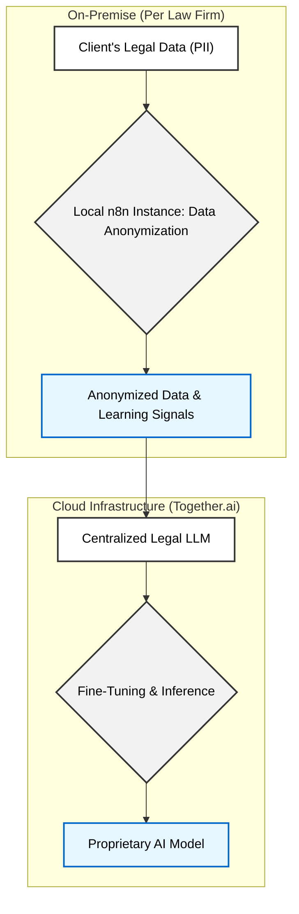

# Law Firm 2030: Central LLM Hosting Recommendation

## 1. Executive Summary

This document outlines the analysis and recommendation for hosting the central Large Language Model (LLM) for our "Law Firm 2030" federated AI infrastructure. After evaluating cloud-based solutions against local on-premise hosting, **I recommend using Together.ai for the centralized LLM.**

This approach offers the best balance of scalability, cost-effectiveness, and operational efficiency, while aligning perfectly with our project's core requirements for data ownership and our "Trusted Handshake" compliance model. It allows us to leverage a powerful, managed infrastructure, enabling us to focus on developing our proprietary legal AI without the significant overhead of building and maintaining a complex hardware stack.

For a detailed technical breakdown, please see the [EXECUTION_PLAN.md](EXECUTION_PLAN.md).

## 2. Hosting Model Comparison

The following table provides a side-by-side comparison of the two primary hosting options based on our key criteria.

| Feature          | Together.ai (Cloud-based)                                                              | Local LLM Hosting (On-premise)                                                              |
| :--------------- | :------------------------------------------------------------------------------------- | :------------------------------------------------------------------------------------------ |
| **Scalability**  | **High & Automatic.** Seamlessly handles growth as more firms join the network.        | **Challenging & Manual.** Requires significant hardware investment and IT expertise to scale. |
| **Cost**         | **Consumption-based.** Lower upfront costs, predictable expenses tied to usage.        | **High Upfront CAPEX.** Requires major initial investment in hardware and ongoing operational costs. |
| **Ownership**    | **Full IP Ownership.** We retain complete ownership of our fine-tuned models and data. | **Absolute Ownership.** Full control over the entire hardware and software stack.           |
| **Compliance**   | **SOC 2 & HIPAA Compliant.** Complements our architecture's primary GDPR controls.     | **Full Control.** Advantageous for compliance but requires extensive internal resources to manage. |

## 3. Project Architecture & Data Flow

Our "Trusted Handshake" model is the cornerstone of our compliance strategy. It ensures sensitive client data never leaves the individual law firm's premises. The central LLM only receives anonymized data and learning signals, allowing it to improve without compromising confidentiality.

*Diagram: The "Trusted Handshake" model ensures Personally Identifiable Information (PII) is processed locally, with only anonymized data sent to the central LLM.*

## 4. Recommendation: Together.ai

Leveraging a specialized cloud platform like **Together.ai** for the central LLM is the most strategic choice.

1.  **Immediate Scalability:** As our network of law firms grows, Together.ai's infrastructure will scale automatically, ensuring reliable performance without requiring us to manage hardware.
2.  **Cost-Effective Growth:** The pay-as-you-go model avoids a massive upfront investment, making the project financially agile and reducing the barrier to entry for participating firms.
3.  **Secure IP Ownership:** We maintain full control and ownership of the fine-tuned legal AI models we develop, which is a non-negotiable requirement for this project.
4.  **Streamlined Compliance:** Our federated architecture is the primary driver of GDPR compliance. Together.ai's certified, secure environment provides an additional layer of trust and handles the infrastructure security, allowing us to focus on our core application.

By choosing Together.ai, we position the "Law Firm 2030" project for sustainable growth and long-term success.