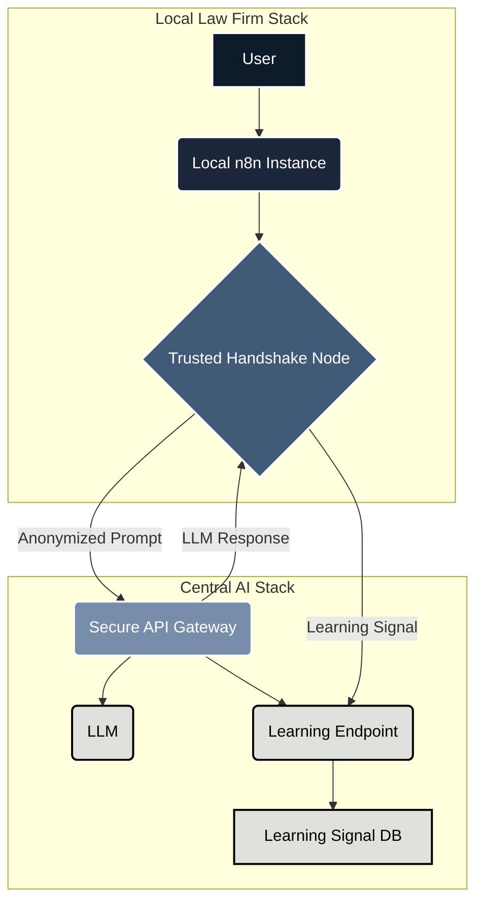

# Law Firm 2030: Federated AI Infrastructure

This repository contains the architectural plan and documentation for the "Law Firm 2030" project, a federated AI infrastructure designed to provide powerful, compliant AI-driven automation to law firms.

## The Vision: The "Trusted Handshake" Model

The core of this project is the **"Trusted Handshake"** model. It's a federated AI architecture designed to solve a critical challenge: how to leverage a powerful, centrally-hosted LLM for legal document processing without compromising client confidentiality or violating GDPR.

The solution is to create a system where:

1.  **Data Stays Local**: Each law firm runs its own local n8n instance, ensuring all sensitive client data remains on-premise.
2.  **Intelligence is Centralized**: A powerful, centrally-hosted LLM provides the core AI capabilities.
3.  **Communication is Secure & Anonymized**: A custom "Trusted Handshake" n8n node strips all PII from documents before sending them to the central AI as structured, anonymized prompts.
4.  **Learning is Abstracted**: The central AI learns and improves not from the data itself, but from abstract "learning signals" (e.g., "the user accepted the draft," "the user heavily edited the draft").

This creates a powerful network effect: the more firms that use the system, the smarter the central AI gets, and the better the service becomes for everyone, all without ever centralizing sensitive data.

## Core Architecture

## Further Reading

For a more detailed breakdown of the project's architecture, development methodology, and technical specifications, please see the [EXECUTION_PLAN.md](EXECUTION_PLAN.md) file.