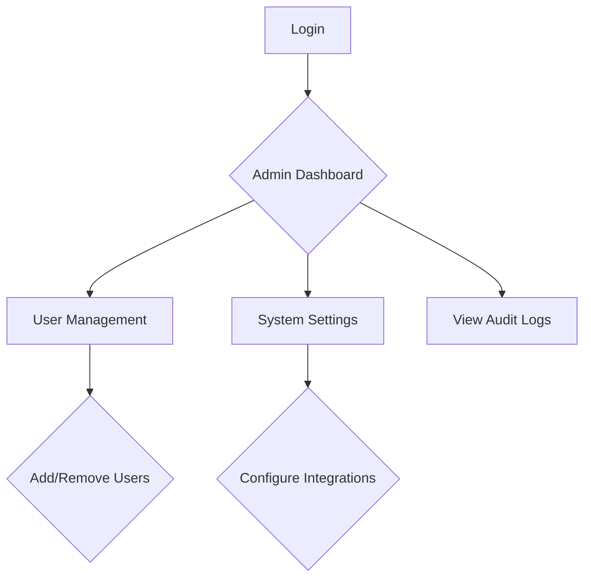
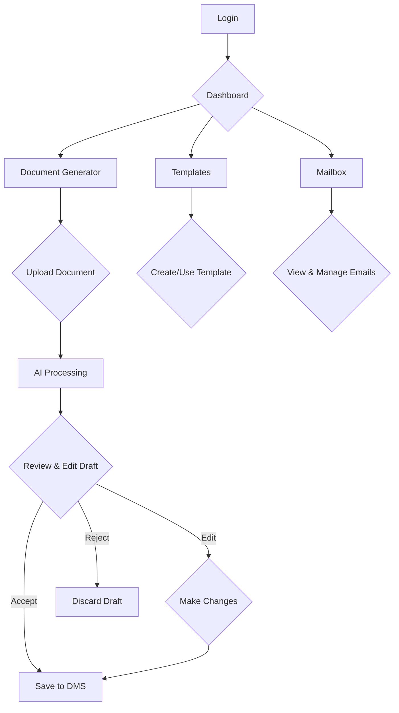

# User Flow Documentation for Law Firm Vision 2030

This document outlines the user flows for the different roles interacting with the Law Firm Vision 2030 platform.

## User Personas

There are two primary user personas for this system:

1.  **The Admin:** This user is responsible for the overall management of the platform within the law firm. They are likely a non-lawyer, such as an office manager or IT administrator. Their primary concerns are user management, system configuration, and ensuring the platform is running smoothly.
2.  **The Legal Assistant/Paralegal:** This user is the primary operator of the AI-powered document processing features. They are responsible for uploading documents, generating drafts, and ensuring the final output is accurate and ready for lawyer review.

---

## 1. Admin User Flow

### Persona: The Admin

The Admin is responsible for setting up and managing the Law Firm Vision 2030 platform for their firm. They are not involved in the day-to-day legal work but ensure that the legal team has the tools they need to be successful.

### Goal

### User Flow Diagram

### Step-by-Step Description

1.  **Login:** The Admin logs into the platform using their credentials.
2.  **Admin Dashboard:** The Admin is presented with a dashboard that provides an overview of the system's status, including the number of active users, documents processed, and system health.
3.  **User Management:** The Admin can navigate to the User Management section to add or remove users from the platform. They can also assign roles to users (e.g., Legal Assistant, Lawyer).
4.  **System Settings:** The Admin can configure system-wide settings, such as integrations with other legal software, notification preferences, and security settings.
5.  **View Audit Logs:** The Admin can view a log of all user activity on the platform for security and compliance purposes.

---

## 2. Legal Assistant/Paralegal User Flow

### Persona: The Legal Assistant/Paralegal

The Legal Assistant is a power user of the Law Firm Vision 2030 platform. They use the platform daily to process legal documents, generate drafts, and prepare materials for the lawyers.

### Goal

The Legal Assistant's primary goal is to use the platform to efficiently process legal documents and generate accurate drafts for lawyer review.

### User Flow Diagram

### Step-by-Step Description

1.  **Login:** The Legal Assistant logs into the platform.
2.  **Dashboard:** The Legal Assistant is presented with a dashboard that provides quick access to the main features of the platform: Document Generator, Mailbox, and Saved Templates.

    

3.  **Document Generator:** The Legal Assistant selects the Document Generator to start a new task.

    

4.  **Upload Document:** The Legal Assistant uploads a legal document (e.g., a contract, a pleading) to the platform. They can either drag and drop the file or select it from their computer.

    

5.  **AI Processing:** The platform's AI processes the document, which includes the following steps:
    *   **Sanitization & Anonymization:** The system removes all personally identifiable information (PII) from the document to ensure data privacy.
    *   **LLM Generates Draft:** The anonymized document is sent to the central LLM, which generates a draft based on the user's request (e.g., a summary, a response).

6.  **Review & Edit Draft:** The Legal Assistant reviews the AI-generated draft. They have three options:
    *   **Accept:** If the draft is accurate and requires no changes, they can accept it.
    *   **Edit:** If the draft is a good starting point but requires some modifications, they can edit it directly in the platform.
    *   **Reject:** If the draft is not useful, they can reject it.

    

7.  **Save to DMS:** Once the draft is finalized, the Legal Assistant can save it to the firm's document management system (DMS).
8.  **Templates:** The Legal Assistant can also create and use templates for frequently used documents to speed up their workflow.
9.  **Mailbox:** The Legal Assistant can view and manage their emails directly within the platform, allowing them to easily process documents received via email.
