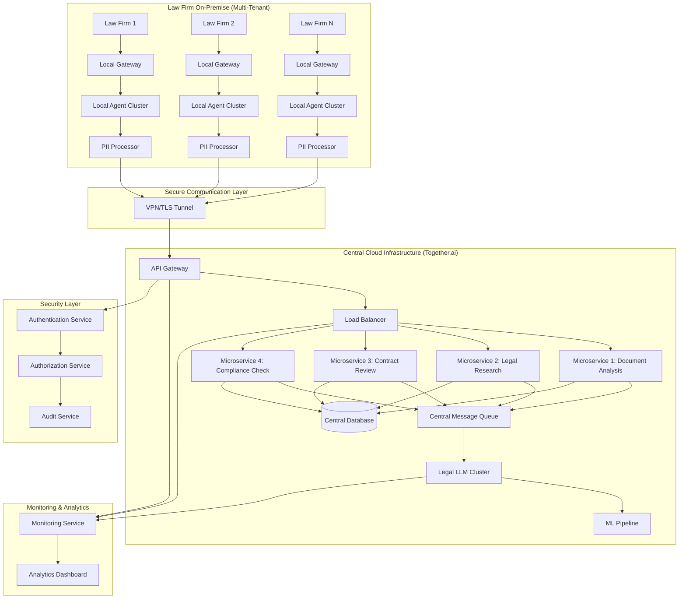

# BMAD Architectural Design Agent - Implementation Guide

## Real-World Application: Law Firm 2030 Project

This document demonstrates how the BMAD Architectural Design Agent would analyze and enhance the existing Law Firm 2030 project architecture, providing concrete examples of its capabilities and outputs.

## Current Project Analysis

### Existing Architecture Assessment

**Current State:**
- Federated AI system with local PII processing
- Central LLM hosted on Together.ai
- n8n-based local agents for data anonymization
- Docker containerization
- Basic web interfaces for document processing

**Architecture Strengths:**
- Privacy-preserving design with local PII handling
- Scalable cloud-based central intelligence
- Clear separation of concerns between local and central processing
- Compliance-focused "Trusted Handshake" model

**Identified Gaps:**
- Limited API standardization across components
- No comprehensive monitoring and observability
- Basic security implementation
- Minimal error handling and resilience patterns
- Limited multi-tenancy support
- No formal integration testing framework

## BMAD Agent Enhancement Recommendations

### 1. Enhanced System Architecture

#### Current vs. Recommended Architecture

**Current Architecture:**
```
Law Firm Local Network → n8n Agent → Together.ai → Central LLM
```

**BMAD Agent Recommended Architecture:**


### 2. Technology Stack Enhancement

#### Recommended Technology Matrix

| Component | Current | BMAD Recommended | Justification |
|-----------|---------|------------------|---------------|
| **Frontend** | HTML/CSS/JS | React/Next.js + TypeScript | Better state management, type safety, SSR |
| **API Gateway** | None | Kong/Zuul | Centralized routing, rate limiting, authentication |
| **Backend Services** | Python Flask | Node.js/Express + Python FastAPI | Language-specific optimization |
| **Message Queue** | None | Apache Kafka + Redis | Async processing, event streaming |
| **Database** | File-based | PostgreSQL + MongoDB + Redis | Structured + unstructured + cache |
| **Container Orchestration** | Docker | Kubernetes + Helm | Scalability, service discovery, management |
| **Monitoring** | Basic logs | Prometheus + Grafana + ELK | Comprehensive observability |
| **Security** | Basic | OAuth2 + JWT + Vault | Enterprise-grade security |
| **CI/CD** | Manual | GitLab CI/Jenkins + ArgoCD | Automated deployment |

### 3. API Standardization

#### Current API Enhancement
```yaml
# Current: Basic Flask routes
# BMAD Recommended: OpenAPI 3.0 Specification

openapi: 3.0.0
info:
  title: Law Firm 2030 API
  version: 1.0.0
  description: Federated Legal AI System API

servers:
  - url: https://api.lawfirm2030.com/v1
    description: Production API
  - url: https://staging-api.lawfirm2030.com/v1
    description: Staging API

paths:
  /documents/analyze:
    post:
      summary: Analyze legal document
      tags: [Document Processing]
      security:
        - bearerAuth: []
      requestBody:
        required: true
        content:
          multipart/form-data:
            schema:
              type: object
              properties:
                document:
                  type: string
                  format: binary
                documentType:
                  type: string
                  enum: [contract, brief, memo, filing]
                analysisType:
                  type: string
                  enum: [pii_scan, compliance_check, risk_assessment]
                firmId:
                  type: string
                  format: uuid
      responses:
        '200':
          description: Analysis completed
          content:
            application/json:
              schema:
                $ref: '#/components/schemas/AnalysisResult'
        '400':
          description: Invalid request
        '401':
          description: Unauthorized
        '429':
          description: Rate limit exceeded

  /firms/{firmId}/analytics:
    get:
      summary: Get firm analytics
      tags: [Analytics]
      security:
        - bearerAuth: []
      parameters:
        - name: firmId
          in: path
          required: true
          schema:
            type: string
            format: uuid
        - name: timeRange
          in: query
          schema:
            type: string
            enum: [day, week, month, quarter, year]
            default: month
      responses:
        '200':
          description: Analytics data
          content:
            application/json:
              schema:
                $ref: '#/components/schemas/FirmAnalytics'

components:
  schemas:
    AnalysisResult:
      type: object
      properties:
        analysisId:
          type: string
          format: uuid
        status:
          type: string
          enum: [completed, processing, failed]
        findings:
          type: array
          items:
            $ref: '#/components/schemas/Finding'
        confidence:
          type: number
          minimum: 0
          maximum: 1
        processingTime:
          type: number
          description: Processing time in milliseconds
        
    Finding:
      type: object
      properties:
        type:
          type: string
          enum: [pii_detected, compliance_issue, risk_factor]
        severity:
          type: string
          enum: [low, medium, high, critical]
        description:
          type: string
        location:
          type: object
          properties:
            page:
              type: integer
            line:
              type: integer
            column:
              type: integer
        recommendation:
          type: string
        
    FirmAnalytics:
      type: object
      properties:
        firmId:
          type: string
          format: uuid
        period:
          type: object
          properties:
            start:
              type: string
              format: date-time
            end:
              type: string
              format: date-time
        metrics:
          type: object
          properties:
            documentsProcessed:
              type: integer
            piiInstancesFound:
              type: integer
            complianceScore:
              type: number
            averageProcessingTime:
              type: number
            costSavings:
              type: number
              
  securitySchemes:
    bearerAuth:
      type: http
      scheme: bearer
      bearerFormat: JWT
```

### 4. Enhanced Security Architecture

#### Multi-Layer Security Implementation
```yaml
security_layers:
  1_network_security:
    - vpn_tunnels: "Site-to-site VPN for firm connections"
    - firewall_rules: "Strict ingress/egress controls"
    - ddos_protection: "CloudFlare DDoS mitigation"
    - network_segmentation: "Isolated network zones"
    
  2_application_security:
    authentication:
      provider: "Auth0 / Keycloak"
      protocols: ["OAuth2", "OpenID Connect"]
      mfa: true
      session_management: "JWT with refresh tokens"
    authorization:
      model: "RBAC + ABAC"
      policies: "Fine-grained permissions"
      audit: "All access logged"
    data_protection:
      encryption_at_rest: "AES-256"
      encryption_in_transit: "TLS 1.3"
      key_management: "HashiCorp Vault"
      
  3_infrastructure_security:
    container_security:
      image_scanning: "Trivy/Clair vulnerability scanning"
      runtime_protection: "Falco behavioral monitoring"
      secrets_management: "Kubernetes secrets + Vault"
    compliance:
      gdpr: "Data minimization, right to be forgotten"
      hipaa: "Audit trails, access controls"
      sox: "Financial data controls"
      iso27001: "Information security management"
```

### 5. Scalability & Performance Architecture

#### Auto-Scaling Configuration
```yaml
kubernetes_scaling:
  horizontal_pod_autoscaler:
    min_replicas: 3
    max_replicas: 100
    target_cpu_utilization: 70%
    target_memory_utilization: 80%
    
  vertical_pod_autoscaler:
    enabled: true
    mode: "Auto"
    
  cluster_autoscaler:
    min_nodes: 2
    max_nodes: 50
    scale_down_delay_after_add: "10m"
    
performance_optimization:
  caching_strategy:
    redis_cluster:
      cache_ttl: "1h"
      max_memory: "4GB"
      eviction_policy: "allkeys-lru"
    cdn:
      provider: "CloudFlare"
      cache_static_assets: true
      edge_locations: "global"
      
  database_optimization:
    connection_pooling:
      max_connections: 100
      idle_timeout: "30s"
    read_replicas: 3
    query_optimization: true
    indexing_strategy: "automated_analysis"
    
  load_balancing:
    algorithm: "least_connections"
    health_checks:
      interval: "30s"
      timeout: "5s"
      failure_threshold: 3
```

### 6. Monitoring & Observability

#### Comprehensive Monitoring Stack
```yaml
monitoring_architecture:
  metrics:
    prometheus:
      retention: "30d"
      scrape_interval: "15s"
      alerting_rules: "custom_legal_metrics"
    grafana:
      dashboards:
        - "System Overview"
        - "Application Performance"
        - "Business Metrics"
        - "Security Dashboard"
        - "Cost Analysis"
        
  logging:
    elasticsearch:
      indices: "date_based_rotation"
      retention: "90d"
    logstash:
      parsing_rules: "structured_logging"
    kibana:
      dashboards: "custom_legal_analysis"
      
  tracing:
    jaeger:
      sampling_rate: "0.1"
      storage: "elasticsearch"
      
  alerts:
    alertmanager:
      channels: ["slack", "email", "pagerduty"]
      escalation_policies: true
      
business_metrics:
  document_processing:
    - "documents_per_hour"
    - "average_processing_time"
    - "error_rate"
    - "pii_detection_accuracy"
  firm_analytics:
    - "active_firms"
    - "monthly_active_users"
    - "cost_per_document"
    - "compliance_score_trends"
  system_health:
    - "uptime_percentage"
    - "response_time_p95"
    - "throughput_capacity"
    - "resource_utilization"
```

### 7. Implementation Roadmap

#### Phase-Based Development Plan

**Phase 1: Foundation (Weeks 1-4)**
- API Gateway implementation
- Authentication/Authorization service
- Basic monitoring setup
- Container orchestration setup

**Phase 2: Core Services (Weeks 5-8)**
- Microservices decomposition
- Message queue implementation
- Database migration and optimization
- Enhanced security implementation

**Phase 3: Advanced Features (Weeks 9-12)**
- Advanced analytics and reporting
- ML pipeline optimization
- Performance tuning
- Compliance automation

**Phase 4: Production Readiness (Weeks 13-16)**
- Load testing and optimization
- Security penetration testing
- Documentation completion
- Production deployment

### 8. Cost Optimization Strategy

#### Resource Optimization Plan
```yaml
cost_optimization:
  infrastructure:
    reserved_instances: "70% of baseline capacity"
    spot_instances: "30% for batch processing"
    auto_scaling: "aggressive scale-down policies"
    resource_tagging: "comprehensive cost allocation"
    
  application:
    code_optimization: "performance_profiling"
    caching: "reduce_database_calls"
    cdn_usage: "static_asset_optimization"
    compression: "gzip_brotli_compression"
    
  monitoring:
    cost_alerts: "budget_threshold_alerts"
    resource_rightsizing: "weekly_analysis"
    unused_resource_detection: "automated_cleanup"
    
projected_savings:
  infrastructure: "30-40% reduction"
  performance: "50% faster response times"
  maintenance: "60% reduction in manual tasks"
  compliance: "80% automated compliance checks"
```

## Agent Integration Example

### Sample Request/Response Flow

**Input Request:**
```json
{
  "projectId": "law-firm-2030",
  "requirements": {
    "functional": [
      "Process 10,000 documents/hour",
      "Support 1,000 concurrent law firms",
      "Real-time PII detection and anonymization",
      "Multi-language document support",
      "Advanced legal analytics and reporting"
    ],
    "nonFunctional": [
      "99.9% uptime SLA",
      "Sub-second response times",
      "GDPR/HIPAA compliance",
      "Zero data breaches tolerance",
      "Cost optimization for scale"
    ],
    "constraints": [
      "Existing Together.ai integration",
      "12-month implementation timeline",
      "$2M total budget",
      "European data residency requirements"
    ]
  },
  "context": {
    "businessDomain": "legal_technology",
    "existingSystems": ["n8n_agents", "basic_web_interface", "docker_containers"],
    "compliance": ["GDPR", "attorney_client_privilege"],
    "budget": {
      "total": 2000000,
      "infrastructure": 800000,
      "development": 1000000,
      "compliance": 200000
    }
  }
}
```

**Agent Response (Abbreviated):**
```json
{
  "architectureDocument": {
    "overview": "Enhanced federated microservices architecture with comprehensive security, monitoring, and compliance automation",
    "systemDecomposition": [
      {
        "name": "API Gateway",
        "responsibilities": ["routing", "rate_limiting", "authentication"],
        "technology": "Kong",
        "scaling": "horizontal"
      },
      {
        "name": "Document Processing Service",
        "responsibilities": ["pii_detection", "anonymization", "analysis"],
        "technology": "Python FastAPI",
        "scaling": "auto"
      }
    ],
    "technologyStack": {
      "frontend": "React/Next.js",
      "backend": "Node.js + Python",
      "database": "PostgreSQL + MongoDB + Redis",
      "messageQueue": "Apache Kafka",
      "containerOrchestration": "Kubernetes",
      "monitoring": "Prometheus + Grafana",
      "security": "OAuth2 + JWT + Vault"
    }
  },
  "implementationRoadmap": {
    "totalDuration": "16 weeks",
    "phases": [
      {
        "name": "Foundation",
        "duration": "4 weeks",
        "deliverables": ["API Gateway", "Auth Service", "Basic Monitoring"]
      }
    ],
    "budget_allocation": {
      "phase1": 400000,
      "phase2": 600000,
      "phase3": 500000,
      "phase4": 300000,
      "contingency": 200000
    }
  }
}
```

This implementation guide demonstrates how the BMAD Architectural Design Agent would enhance the existing Law Firm 2030 project, providing concrete improvements in architecture, security, scalability, and operational efficiency while maintaining the core privacy-preserving design principles.