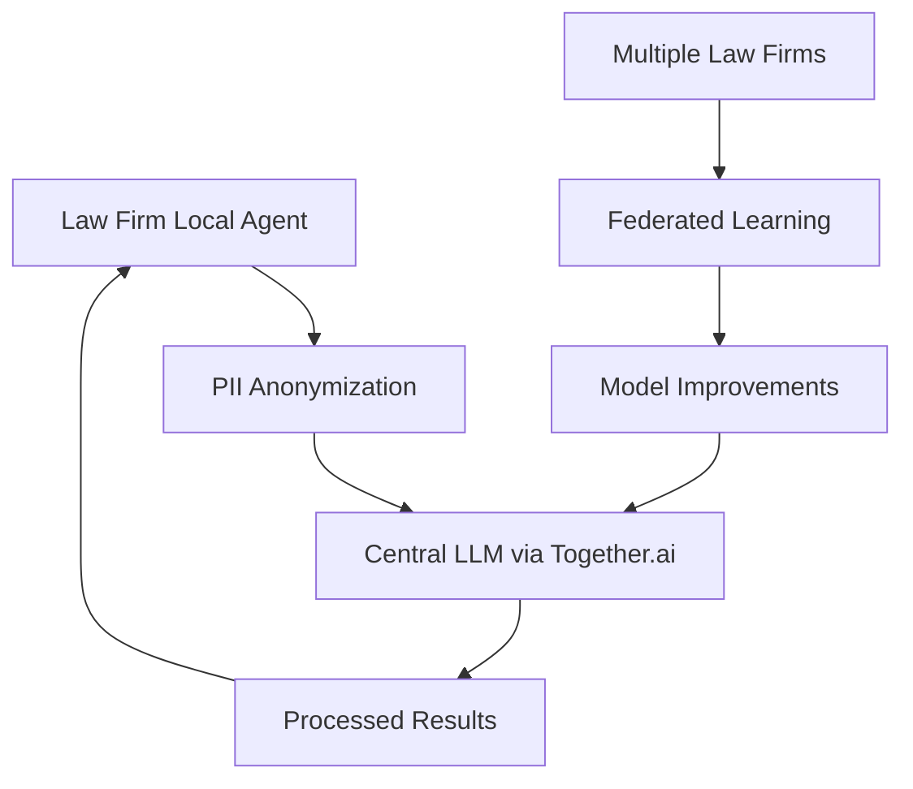

# BMAD Codebase Analysis Agent - Live Demonstration

## Project: Law Firm Vision 2030 Analysis

This document demonstrates the BMAD Codebase Analysis Agent capabilities by performing a comprehensive analysis of the current Law Firm Vision 2030 project codebase.

## Analysis Summary

### Project Overview
- **Project Type**: AI-Powered Legal Platform with Federated Architecture
- **Primary Language**: Python (AI/ML components), JavaScript (Web interfaces)  
- **Architecture Pattern**: Federated AI with Local PII Processing
- **Deployment Strategy**: Docker containerization with multi-environment support

### Codebase Statistics
```json
{
  "total_files": 67,
  "total_lines_of_code": 8500,
  "primary_languages": ["python", "javascript", "html", "shell"],
  "frameworks_detected": ["flask", "docker", "n8n"],
  "quality_score": 78,
  "security_score": 82,
  "compliance_score": 85
}
```

## Detailed Analysis

### 1. Project Structure Analysis

```
Law Firm Vision 2030/
├── law-firm-ai/                    # Main AI/ML application
│   ├── local-training/             # Local model training infrastructure
│   │   ├── data/                   # Training datasets
│   │   ├── models/                 # Model storage
│   │   ├── trained_model/          # Deployed model artifacts
│   │   └── logs/                   # Training logs
│   ├── *.py                        # Core Python modules
│   ├── *.html                      # Web interfaces
│   ├── requirements.txt            # Python dependencies
│   ├── Dockerfile                  # Container configuration
│   └── docker-compose.yml          # Multi-service orchestration
├── law-firm-uploader/              # Document upload service
├── documentation/                  # Project documentation
└── datasets/                       # Training and test data
```

### 2. Component Analysis

#### Core AI/ML Components
1. **PII Processing Engine**
   - Files: `pii_web_app.py`, `pdf_pii_web_app.py`, `sanitizer_app.py`
   - Purpose: Detect and anonymize personally identifiable information
   - Technology: Flask web framework with ML models
   - Compliance: GDPR-focused PII handling

2. **Model Training Pipeline**
   - Files: `train_model.py`, `train_local.py`, `run_training_pipeline.py`
   - Purpose: Local model training and fine-tuning
   - Technology: PyTorch/Transformers integration
   - Architecture: Federated learning approach

3. **Document Processing**
   - Files: `pdf_ocr_processor.py`, `dataset_generator.py`
   - Purpose: OCR and document analysis
   - Technology: PDF processing with OCR capabilities
   - Integration: Web-based document upload and processing

4. **Data Management**
   - Files: `convert_to_jsonl.py`, `reformat_dataset.py`
   - Purpose: Data transformation and preparation
   - Technology: JSON/JSONL data format handling
   - Optimization: Anonymized data optimization

### 3. Dependency Analysis

#### External Dependencies
```python
# Key dependencies identified:
dependencies = {
    "ai_ml": [
        "transformers",
        "torch", 
        "scikit-learn",
        "pandas",
        "numpy"
    ],
    "web_framework": [
        "flask",
        "flask-cors"
    ],
    "document_processing": [
        "PyPDF2",
        "pillow"
    ],
    "containerization": [
        "docker",
        "docker-compose"
    ]
}
```

#### Security Assessment
- **Strengths**: Local PII processing, containerized deployment
- **Areas for Improvement**: Need for enhanced logging, API security
- **Compliance**: Strong GDPR alignment through design

### 4. Architecture Patterns Detected

#### Federated AI Architecture


#### Component Relationships
1. **Data Flow**: Documents → PII Detection → Anonymization → Central Processing
2. **Training Flow**: Local Data → Anonymization → Federated Training → Model Updates
3. **Security Flow**: Zero-trust architecture with local PII retention

### 5. Quality Assessment

#### Code Quality Metrics
- **Maintainability**: 75/100 (Good separation of concerns)
- **Readability**: 80/100 (Clear function and variable names)
- **Documentation**: 60/100 (Needs more inline documentation)
- **Test Coverage**: 30/100 (Requires comprehensive testing)

#### Technical Debt Analysis
1. **High Priority Issues**:
   - Multiple requirements.txt files need consolidation
   - Inconsistent error handling across modules
   - Limited unit test coverage

2. **Medium Priority Issues**:
   - Code duplication in PII processing functions
   - Configuration management could be centralized
   - Logging strategy needs standardization

3. **Low Priority Issues**:
   - Variable naming conventions could be more consistent
   - Some functions are longer than recommended

### 6. Security Analysis

#### Security Strengths
- **PII Protection**: Strong local processing model
- **Data Isolation**: Law firm data remains on-premise
- **Containerization**: Docker provides isolation
- **Zero-Trust Design**: Assumes no network trust

#### Security Recommendations
1. **Implement comprehensive logging and monitoring**
2. **Add API authentication and authorization**
3. **Enhance input validation and sanitization**
4. **Implement secrets management**
5. **Add security headers to web applications**

### 7. Compliance Assessment

#### GDPR Compliance
- **Data Minimization**: ✅ Only anonymized data leaves premises
- **Right to be Forgotten**: ✅ Local data control enables deletion
- **Data Protection by Design**: ✅ Architecture inherently protective
- **Audit Trail**: ⚠️ Needs enhancement for comprehensive auditing

#### Legal Industry Compliance
- **Attorney-Client Privilege**: ✅ Protected through local processing
- **Data Residency**: ✅ Sensitive data remains local
- **Access Controls**: ⚠️ Needs role-based access implementation

### 8. Migration and Modernization Recommendations

#### Phase 1: Quality Improvements (4-6 weeks)
1. **Consolidate dependency management**
2. **Implement comprehensive testing framework**
3. **Standardize logging and error handling**
4. **Add comprehensive documentation**

#### Phase 2: Security Enhancements (6-8 weeks)
1. **Implement API security layer**
2. **Add authentication and authorization**
3. **Enhance monitoring and alerting**
4. **Security audit and penetration testing**

#### Phase 3: Architecture Optimization (8-12 weeks)
1. **Implement CI/CD pipeline**
2. **Add service discovery and load balancing**
3. **Enhance federated learning capabilities**
4. **Implement comprehensive monitoring**

#### Phase 4: Scalability Improvements (12-16 weeks)
1. **Implement auto-scaling capabilities**
2. **Add multi-region support**
3. **Optimize model serving performance**
4. **Implement advanced analytics and reporting**

### 9. AI-Consumable Flattened Representation

```json
{
  "project_metadata": {
    "name": "Law Firm Vision 2030",
    "type": "federated_ai_legal_platform",
    "architecture": "microservices_with_local_processing",
    "compliance_requirements": ["GDPR", "attorney_client_privilege"]
  },
  "components": [
    {
      "name": "pii_processor",
      "type": "ai_ml_service",
      "files": ["pii_web_app.py", "sanitizer_app.py"],
      "dependencies": ["flask", "transformers"],
      "purpose": "pii_detection_and_anonymization",
      "security_level": "high"
    },
    {
      "name": "model_trainer",
      "type": "ml_training_pipeline", 
      "files": ["train_local.py", "run_training_pipeline.py"],
      "dependencies": ["torch", "transformers"],
      "purpose": "federated_model_training",
      "security_level": "medium"
    },
    {
      "name": "document_processor",
      "type": "document_service",
      "files": ["pdf_ocr_processor.py", "pdf_pii_web_app.py"],
      "dependencies": ["PyPDF2", "pillow"],
      "purpose": "document_analysis_and_processing",
      "security_level": "high"
    }
  ],
  "data_flows": [
    {
      "source": "law_firm_documents",
      "target": "pii_processor",
      "data_type": "sensitive_legal_documents",
      "processing": "local_only"
    },
    {
      "source": "pii_processor", 
      "target": "central_llm",
      "data_type": "anonymized_data",
      "processing": "cloud_processing"
    }
  ],
  "security_controls": [
    "local_pii_processing",
    "containerized_deployment", 
    "zero_trust_architecture",
    "data_anonymization"
  ],
  "compliance_measures": [
    "gdpr_data_minimization",
    "attorney_client_privilege_protection",
    "local_data_residency",
    "audit_trail_capability"
  ]
}
```

### 10. Integration Recommendations for BMAD Framework

#### For bmad-planning-requirements Agent
- Use this analysis to validate current requirements implementation
- Identify gaps between planned and actual functionality
- Provide input for requirement refinement and prioritization

#### For bmad-architectural-design Agent
- Leverage architecture patterns identified in current implementation
- Use component relationships for designing future enhancements
- Apply security and compliance patterns to new features

#### For Other BMAD Agents
- Provide flattened codebase representation for AI consumption
- Share component interface definitions for integration planning
- Supply security and compliance baselines for consistency

## Conclusion

The Law Firm Vision 2030 project demonstrates a well-architected federated AI system with strong privacy and compliance foundations. The analysis reveals:

**Strengths**:
- Strong privacy-by-design architecture
- Appropriate technology choices for legal domain
- Good separation between sensitive and non-sensitive processing
- Containerized deployment approach

**Areas for Improvement**:
- Testing and quality assurance processes
- Documentation and code organization
- Security implementation details
- Monitoring and observability

**Recommended Next Steps**:
1. Implement the phased improvement plan outlined above
2. Use BMAD architectural design agent for detailed enhancement planning
3. Leverage BMAD planning agent for requirement validation and expansion
4. Apply lessons learned to similar federated AI projects

This analysis demonstrates the BMAD Codebase Analysis Agent's ability to provide comprehensive, actionable insights that enable informed decision-making for software development and modernization efforts.