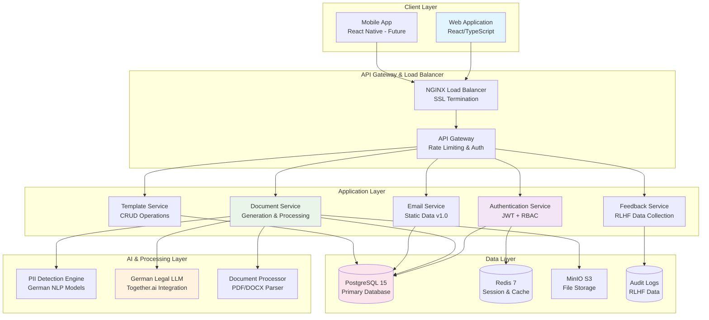
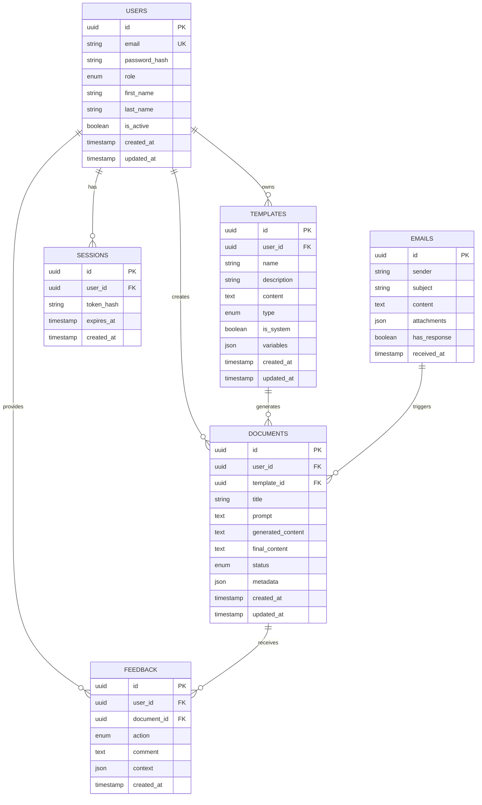

# AnwaltsAI System Architecture Design

## Executive Summary

This document presents a comprehensive system architecture for AnwaltsAI v1.0, a specialized legal AI document generation platform for German law firms. The architecture supports 50+ concurrent users with enterprise-grade security, AI integration with RLHF feedback loops, and a scalable React/Node.js technology stack.

---

## 1. High-Level System Architecture

### 1.1 Component Overview



### 1.2 System Flow Architecture

```
┌─────────────────────────────────────────────────────────────────┐
│                    ANWALTS AI SYSTEM FLOW                      │
│                                                                 │
│  1. User Authentication                                         │
│     ┌─────────────────┐      ┌─────────────────┐               │
│     │  React Frontend │ ──► │  JWT Auth API   │               │
│     │  Login Form     │      │  Role Validation│               │
│     └─────────────────┘      └─────────────────┘               │
│              │                        │                       │
│              ▼                        ▼                       │
│  2. Document Generation Workflow                               │
│     ┌─────────────────┐      ┌─────────────────┐               │
│     │  Upload/Prompt  │ ──► │  PII Detection  │               │
│     │  File + Context │      │  Anonymization  │               │
│     └─────────────────┘      └─────────────────┘               │
│              │                        │                       │
│              ▼                        ▼                       │
│     ┌─────────────────┐      ┌─────────────────┐               │
│     │  Together.ai    │ ──► │  AI Response    │               │
│     │  German LLM     │      │  Generation     │               │
│     └─────────────────┘      └─────────────────┘               │
│              │                        │                       │
│              ▼                        ▼                       │
│  3. User Feedback Loop (RLHF)                                  │
│     ┌─────────────────┐      ┌─────────────────┐               │
│     │  Accept/Reject  │ ──► │  Feedback DB    │               │
│     │  Edit & Improve │      │  Model Training │               │
│     └─────────────────┘      └─────────────────┘               │
└─────────────────────────────────────────────────────────────────┘
```

---

## 2. Technology Stack Recommendations

### 2.1 Frontend Stack
```yaml
Framework: React 18.2.0
Language: TypeScript 5.0+
State Management: Zustand 4.4.0
UI Components: Material-UI 5.14.0
Styling: Emotion + CSS-in-JS
Build Tool: Vite 4.4.0
Package Manager: pnpm 8.6.0
```

### 2.2 Backend Stack
```yaml
Runtime: Node.js 18.17 LTS
Framework: Express.js 4.18.0
Language: TypeScript 5.0+
API Documentation: OpenAPI 3.0 + Swagger
Validation: Joi 17.9.0
Testing: Jest 29.0 + Supertest
Process Manager: PM2 5.3.0
```

### 2.3 Database & Storage
```yaml
Primary Database: PostgreSQL 15.3
Cache Layer: Redis 7.0.11
File Storage: MinIO (S3-compatible)
Search Engine: PostgreSQL Full-Text Search
Migration Tool: Knex.js 2.5.0
Connection Pool: pg-pool
```

### 2.4 Infrastructure & DevOps
```yaml
Containerization: Docker 24.0 + Docker Compose
Web Server: NGINX 1.24
SSL Certificates: Let's Encrypt
Process Monitoring: PM2 + Prometheus
Log Management: Winston + ELK Stack
CI/CD: GitHub Actions
Deployment: Docker Swarm (Production)
```

### 2.5 AI & ML Integration
```yaml
German LLM Provider: Together.ai
PII Detection: spaCy 3.6 (de_core_news_lg)
Document Processing: pdf-parse + mammoth
NLP Libraries: compromise + natural
API Integration: axios + retry logic
```

---

## 3. Database Schema Design

### 3.1 Core Entity Relationships



### 3.2 Detailed Schema Definitions

**Users Table:**
```sql
CREATE TABLE users (
    id UUID PRIMARY KEY DEFAULT gen_random_uuid(),
    email VARCHAR(255) UNIQUE NOT NULL,
    password_hash VARCHAR(255) NOT NULL,
    role user_role NOT NULL DEFAULT 'assistant',
    first_name VARCHAR(100) NOT NULL,
    last_name VARCHAR(100) NOT NULL,
    is_active BOOLEAN DEFAULT true,
    last_login_at TIMESTAMP,
    created_at TIMESTAMP DEFAULT CURRENT_TIMESTAMP,
    updated_at TIMESTAMP DEFAULT CURRENT_TIMESTAMP
);

CREATE TYPE user_role AS ENUM ('admin', 'assistant');
```

**Documents Table:**
```sql
CREATE TABLE documents (
    id UUID PRIMARY KEY DEFAULT gen_random_uuid(),
    user_id UUID NOT NULL REFERENCES users(id),
    template_id UUID REFERENCES templates(id),
    title VARCHAR(255) NOT NULL,
    prompt TEXT,
    generated_content TEXT,
    final_content TEXT,
    status document_status DEFAULT 'draft',
    metadata JSONB DEFAULT '{}',
    processing_time_ms INTEGER,
    confidence_score DECIMAL(3,2),
    created_at TIMESTAMP DEFAULT CURRENT_TIMESTAMP,
    updated_at TIMESTAMP DEFAULT CURRENT_TIMESTAMP
);

CREATE TYPE document_status AS ENUM ('draft', 'generated', 'accepted', 'rejected');
```

**Templates Table:**
```sql
CREATE TABLE templates (
    id UUID PRIMARY KEY DEFAULT gen_random_uuid(),
    user_id UUID REFERENCES users(id),
    name VARCHAR(255) NOT NULL,
    description TEXT,
    content TEXT NOT NULL,
    type template_type NOT NULL,
    is_system BOOLEAN DEFAULT false,
    variables JSONB DEFAULT '[]',
    usage_count INTEGER DEFAULT 0,
    created_at TIMESTAMP DEFAULT CURRENT_TIMESTAMP,
    updated_at TIMESTAMP DEFAULT CURRENT_TIMESTAMP
);

CREATE TYPE template_type AS ENUM ('mahnung', 'nda', 'contract', 'letter', 'custom');
```

**Feedback Table (RLHF Data):**
```sql
CREATE TABLE feedback (
    id UUID PRIMARY KEY DEFAULT gen_random_uuid(),
    user_id UUID NOT NULL REFERENCES users(id),
    document_id UUID NOT NULL REFERENCES documents(id),
    action feedback_action NOT NULL,
    comment TEXT,
    context JSONB DEFAULT '{}',
    created_at TIMESTAMP DEFAULT CURRENT_TIMESTAMP
);

CREATE TYPE feedback_action AS ENUM ('accept', 'reject', 'improve');
```

---

## 4. API Architecture

### 4.1 RESTful API Design

**Base URL Structure:**
```
https://api.anwalts-ai.de/v1/
```

### 4.2 Core API Endpoints

**Authentication Endpoints:**
```typescript
POST /auth/login
POST /auth/logout
POST /auth/refresh
GET  /auth/profile
PUT  /auth/profile
```

**Document Management:**
```typescript
GET    /documents                 // List user documents
POST   /documents                 // Create new document
GET    /documents/:id             // Get document details
PUT    /documents/:id             // Update document
DELETE /documents/:id             // Delete document
POST   /documents/generate        // AI generation endpoint
POST   /documents/:id/feedback    // Submit RLHF feedback
```

**Template Management:**
```typescript
GET    /templates                 // List templates (system + user)
POST   /templates                 // Create custom template
GET    /templates/:id             // Get template details
PUT    /templates/:id             // Update template
DELETE /templates/:id             // Delete custom template
```

**Email Management (Static v1.0):**
```typescript
GET    /emails                    // List emails (static data)
GET    /emails/:id                // Get email details
POST   /emails/:id/respond        // Generate response to email
```

### 4.3 API Request/Response Examples

**Document Generation Request:**
```typescript
POST /documents/generate
Content-Type: multipart/form-data

{
  "prompt": "Generate a payment reminder for overdue invoice",
  "template_id": "uuid-template-id",
  "uploaded_file": [binary],
  "options": {
    "enable_pii_removal": true,
    "response_language": "de",
    "document_type": "mahnung"
  }
}
```

**Document Generation Response:**
```typescript
{
  "success": true,
  "data": {
    "document_id": "uuid-doc-id",
    "generated_content": "Sehr geehrte Damen und Herren...",
    "confidence_score": 0.95,
    "processing_time_ms": 2500,
    "pii_detected": true,
    "suggestions": ["Consider adding specific payment terms"]
  },
  "meta": {
    "timestamp": "2025-01-28T10:30:00Z",
    "api_version": "1.0"
  }
}
```

**RLHF Feedback Request:**
```typescript
POST /documents/:id/feedback
{
  "action": "improve",
  "comment": "Need more formal tone",
  "edited_content": "Improved version text...",
  "context": {
    "editing_time_seconds": 45,
    "changes_made": "tone_adjustment"
  }
}
```

---

## 5. Security Implementation

### 5.1 Authentication & Authorization

**JWT Implementation:**
```typescript
interface JWTPayload {
  userId: string;
  email: string;
  role: 'admin' | 'assistant';
  firmId: string;
  exp: number;
  iat: number;
}

// Token Configuration
const JWT_CONFIG = {
  accessTokenExpiry: '1h',
  refreshTokenExpiry: '7d',
  algorithm: 'RS256',
  issuer: 'anwalts-ai.de'
};
```

**Role-Based Access Control (RBAC):**
```typescript
const PERMISSIONS = {
  admin: [
    'documents:read', 'documents:write', 'documents:delete',
    'templates:read', 'templates:write', 'templates:delete',
    'users:read', 'users:write', 'analytics:read'
  ],
  assistant: [
    'documents:read', 'documents:write',
    'templates:read', 'templates:write:own'
  ]
};
```

### 5.2 Data Protection

**Encryption Standards:**
```yaml
In Transit: TLS 1.3 minimum
At Rest: AES-256-GCM
Database: Transparent Data Encryption
Passwords: Argon2id hashing
API Keys: HMAC-SHA256 signatures
```

**GDPR Compliance Features:**
```typescript
const GDPR_FEATURES = {
  data_anonymization: 'Automatic PII removal',
  right_to_delete: 'Complete user data deletion',
  data_portability: 'JSON export functionality',
  consent_management: 'Granular privacy controls',
  audit_logging: 'Complete action tracking'
};
```

### 5.3 Security Middleware Stack

```typescript
// Express Security Middleware
app.use(helmet({
  contentSecurityPolicy: {
    directives: {
      defaultSrc: ["'self'"],
      scriptSrc: ["'self'", "'unsafe-inline'"],
      styleSrc: ["'self'", "'unsafe-inline'"],
      imgSrc: ["'self'", "data:", "https:"]
    }
  }
}));

app.use(rateLimit({
  windowMs: 15 * 60 * 1000, // 15 minutes
  max: 100, // Limit each IP to 100 requests per windowMs
  standardHeaders: true,
  legacyHeaders: false
}));

app.use(cors({
  origin: process.env.FRONTEND_URL,
  credentials: true,
  optionsSuccessStatus: 200
}));
```

---

## 6. Deployment Strategy

### 6.1 Production Environment Architecture

```yaml
Environment: Production
Infrastructure: Docker Swarm Cluster
Nodes: 3x Application Nodes + 1x Database Node
Load Balancer: NGINX with SSL termination
Monitoring: Prometheus + Grafana
Logging: ELK Stack (Elasticsearch, Logstash, Kibana)
```

### 6.2 Docker Configuration

**Application Dockerfile:**
```dockerfile
FROM node:18-alpine AS builder
WORKDIR /app
COPY package*.json ./
RUN npm ci --only=production

FROM node:18-alpine AS runtime
RUN addgroup -g 1001 -S nodejs
RUN adduser -S anwalts -u 1001
WORKDIR /app
COPY --from=builder --chown=anwalts:nodejs /app/node_modules ./node_modules
COPY --chown=anwalts:nodejs . .
USER anwalts
EXPOSE 3000
CMD ["npm", "start"]
```

**Docker Compose (Production):**
```yaml
version: '3.8'
services:
  app:
    image: anwalts-ai:latest
    replicas: 3
    environment:
      - NODE_ENV=production
      - DATABASE_URL=${DATABASE_URL}
      - REDIS_URL=${REDIS_URL}
      - JWT_SECRET=${JWT_SECRET}
    networks:
      - anwalts-network
    
  nginx:
    image: nginx:alpine
    ports:
      - "80:80"
      - "443:443"
    volumes:
      - ./nginx.conf:/etc/nginx/nginx.conf
      - ./ssl:/etc/ssl
    networks:
      - anwalts-network
    
  postgres:
    image: postgres:15-alpine
    environment:
      - POSTGRES_DB=anwalts_ai
      - POSTGRES_PASSWORD=${DB_PASSWORD}
    volumes:
      - postgres_data:/var/lib/postgresql/data
    networks:
      - anwalts-network
    
  redis:
    image: redis:7-alpine
    command: redis-server --appendonly yes
    volumes:
      - redis_data:/data
    networks:
      - anwalts-network

networks:
  anwalts-network:
    driver: overlay

volumes:
  postgres_data:
  redis_data:
```

### 6.3 Deployment Pipeline

**GitHub Actions Workflow:**
```yaml
name: Deploy AnwaltsAI
on:
  push:
    branches: [main]

jobs:
  deploy:
    runs-on: ubuntu-latest
    steps:
      - uses: actions/checkout@v3
      
      - name: Build Docker Images
        run: |
          docker build -t anwalts-ai:${{ github.sha }} .
          docker tag anwalts-ai:${{ github.sha }} anwalts-ai:latest
          
      - name: Run Tests
        run: |
          npm test
          npm run test:e2e
          
      - name: Security Scan
        run: |
          docker run --rm -v "$PWD":/app clair:latest
          
      - name: Deploy to Production
        run: |
          docker stack deploy -c docker-compose.prod.yml anwalts-ai
```

### 6.4 Scaling Strategy

**Horizontal Scaling Plan:**
```
Phase 1 (0-50 users):    1x App + 1x DB Node
Phase 2 (50-200 users):  3x App + 1x DB Node  
Phase 3 (200-500 users): 5x App + 2x DB Nodes (Read Replicas)
Phase 4 (500+ users):    Auto-scaling + Kubernetes migration
```

**Performance Monitoring:**
```typescript
const PERFORMANCE_TARGETS = {
  api_response_time: '<200ms (95th percentile)',
  document_generation: '<30s average',
  uptime: '99.9%',
  concurrent_users: '50+ supported',
  database_connections: 'Max 100 per node'
};
```

---

## 7. Integration Points

### 7.1 AI Service Integration (Together.ai)

**Configuration:**
```typescript
const TOGETHER_AI_CONFIG = {
  baseURL: 'https://api.together.xyz',
  model: 'deepseek-ai/deepseek-v3',
  maxTokens: 4096,
  temperature: 0.3,
  timeout: 30000,
  retries: 3
};
```

**Error Handling & Fallbacks:**
```typescript
class AIServiceError extends Error {
  constructor(message: string, public code: string) {
    super(message);
  }
}

const AI_FALLBACK_STRATEGY = {
  primary: 'together-ai',
  secondary: 'local-model', // Future implementation
  cache: 'redis-cache',
  timeout: '30s'
};
```

### 7.2 PII Detection Integration

**German NLP Pipeline:**
```typescript
const PII_DETECTION_CONFIG = {
  language: 'de',
  model: 'de_core_news_lg',
  patterns: {
    names: /\b[A-ZÄÖÜ][a-zäöüß]+\s+[A-ZÄÖÜ][a-zäöüß]+\b/g,
    emails: /\b[A-Za-z0-9._%+-]+@[A-Za-z0-9.-]+\.[A-Z|a-z]{2,}\b/g,
    phones: /\+49\s?\d{2,4}\s?\d{6,8}/g,
    addresses: /\b\d{5}\s+[A-ZÄÖÜ][a-zäöüß]+\b/g
  }
};
```

---

## 8. Monitoring & Analytics

### 8.1 Application Monitoring

**Key Metrics:**
```typescript
const MONITORING_METRICS = {
  business: {
    daily_active_users: 'DAU tracking',
    documents_generated: 'Generation count',
    feedback_ratio: 'Accept/Reject ratio',
    template_usage: 'Most used templates'
  },
  technical: {
    api_latency: 'Response time percentiles',
    error_rate: '4xx/5xx error tracking',
    database_performance: 'Query performance',
    ai_service_health: 'Together.ai uptime'
  }
};
```

### 8.2 RLHF Data Analytics

**Feedback Analytics:**
```sql
-- RLHF Performance Query
SELECT 
  DATE_TRUNC('week', created_at) as week,
  action,
  COUNT(*) as feedback_count,
  AVG(CASE WHEN action = 'accept' THEN 1.0 ELSE 0.0 END) as acceptance_rate
FROM feedback 
GROUP BY week, action 
ORDER BY week DESC;
```

---

## Implementation Roadmap

### Phase 1: Core Foundation (Weeks 1-4)
- [ ] Set up development environment
- [ ] Implement authentication system
- [ ] Create database schema and migrations
- [ ] Build basic React frontend structure

### Phase 2: Document Generation (Weeks 5-8)
- [ ] Integrate Together.ai API
- [ ] Implement PII detection pipeline
- [ ] Build document generation UI
- [ ] Add RLHF feedback system

### Phase 3: Templates & Email (Weeks 9-12)
- [ ] Create template management system
- [ ] Implement static email interface
- [ ] Add user dashboard
- [ ] Performance optimization

### Phase 4: Production Deployment (Weeks 13-16)
- [ ] Security audit and hardening
- [ ] Set up monitoring and logging
- [ ] Deploy to production environment
- [ ] User acceptance testing

---

*Document Version: 1.0*  
*Generated: January 28, 2025*  
*Classification: Technical Architecture Specification*